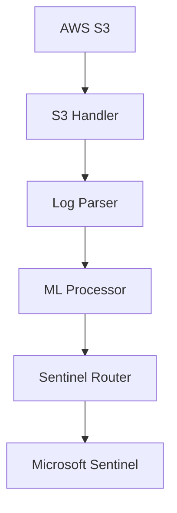
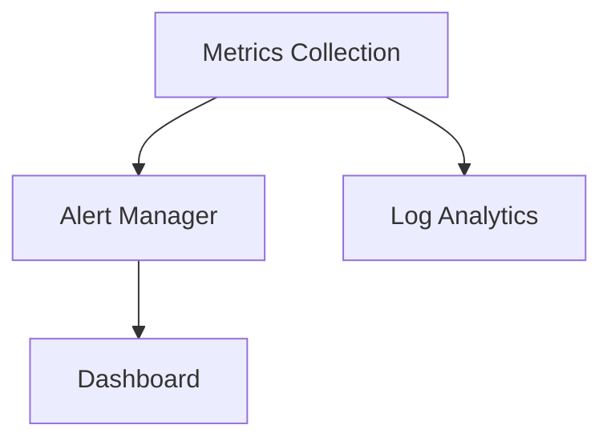

# docs/architecture.md

# S3 to Sentinel Connector Architecture

## Overview

The S3 to Sentinel Connector is a high-performance, secure system for transferring logs from AWS S3 to Microsoft Sentinel. The system incorporates ML-powered enhancements for intelligent log processing and anomaly detection.

## System Components

### 1. Core Components



#### S3 Handler
- Manages AWS S3 connections
- Implements efficient batch processing
- Handles retry logic and error recovery
- Provides streaming capabilities

#### Log Parser
- Supports multiple log formats
- Implements format detection
- Performs field normalization
- Validates log integrity

#### ML Processor
- Performs anomaly detection
- Classifies log priority
- Identifies patterns
- Updates models in real-time

#### Sentinel Router
- Manages Sentinel connections
- Handles data transformation
- Implements batching logic
- Ensures delivery guarantees

### 2. Security Layer


- Secure credential management
- Data encryption at rest and in transit
- Role-based access control
- Comprehensive audit logging

### 3. Monitoring System



- Real-time metrics collection
- Configurable alerting
- Performance monitoring
- Health checks

## Data Flow

1. **Ingestion**
   ```plaintext
   S3 Event → S3 Handler → Raw Log Data
   ```

2. **Processing**
   ```plaintext
   Raw Log → Parser → Structured Data → ML Enhancement → Enriched Log
   ```

3. **Delivery**
   ```plaintext
   Enriched Log → Sentinel Router → Microsoft Sentinel
   ```

## Performance Considerations

- Batch processing optimization
- Caching strategies
- Connection pooling
- Resource management

## Security Measures

- Encryption in transit and at rest
- Secure credential handling
- Access control
- Audit logging