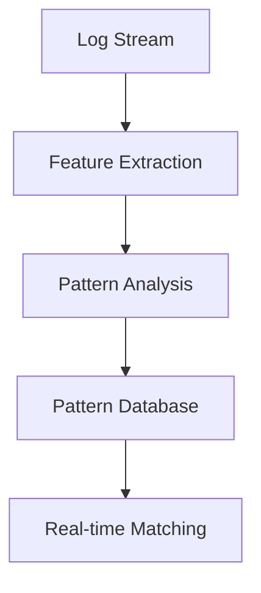

# ML-Enhanced Features

## Overview

The S3 to Sentinel Connector incorporates machine learning capabilities for intelligent log processing and anomaly detection.

## ML Components

### 1. Anomaly Detection

```python
# Example usage
from src.ml.enhanced_connector import MLEnhancedConnector

connector = MLEnhancedConnector()
anomalies = await connector.detect_anomalies(logs)
```

#### Features
- Real-time anomaly detection
- Pattern-based analysis
- Adaptive thresholds
- Historical comparison

### 2. Log Classification

```python
# Priority classification
priorities = await connector.get_priorities(logs)
```

#### Classification Categories
- Critical security events
- System errors
- Performance issues
- Normal operations

### 3. Pattern Recognition



#### Capabilities
- Sequence detection
- Correlation analysis
- Trend identification
- Frequency analysis

## Model Management

### 1. Training

```python
# Model update
await connector.update_models(features, labels)
```

### 2. Evaluation

```python
# Performance metrics
metrics = await connector.evaluate_models()
```

### 3. Deployment

```bash
# Deploy updated models
./scripts/deploy_models.sh
```

## Integration Points

### 1. Log Processing Pipeline


### 2. Alert Generation

```python
# Alert configuration
alerts = {
    'anomaly_threshold': 0.95,
    'priority_threshold': 0.8
}
```

## Performance Considerations

### 1. Batch Processing
- Optimal batch size
- Processing intervals
- Resource utilization

### 2. Model Updates
- Update frequency
- Data retention
- Performance impact

## Monitoring

### 1. ML Metrics
- Model accuracy
- Processing latency
- Resource usage

### 2. Alerts
- Model drift
- Performance degradation
- Resource constraints