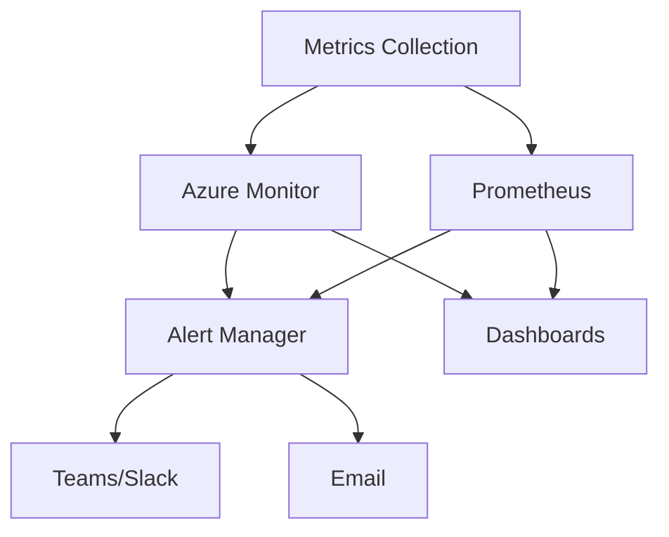
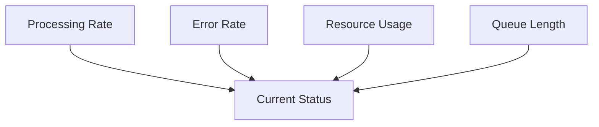
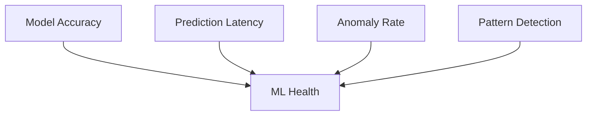

# docs/monitoring.md

# Monitoring and Observability Guide

## Overview

**Note:** The alerting system (utilizing `AlertManager` from `src/monitoring/alerts.py`) and some advanced custom metrics collection (potentially from `src/monitoring/metrics.py`) are foundational components. While `alerts.py` now exists with a placeholder structure and `metrics.py` (formerly `component_metrics.py`) provides core metrics, the full scope of documented alerting rules and highly specific custom metrics may require further implementation.

The S3 to Sentinel Connector implements a comprehensive monitoring system that provides real-time insights into system performance, health, and security.

## Monitoring Architecture



## Key Metrics

### 1. Performance Metrics

#### Processing Latency
```python
# Example metric collection
await monitor.record_metric(
    name='processing_latency_seconds',
    value=latency,
    labels={
        'component': 'log_processor',
        'log_type': 'firewall'
    }
)
```

| Metric | Description | Threshold | Severity |
|--------|-------------|-----------|----------|
| `processing_latency_seconds` | Log processing time | > 300s | High |
| `batch_processing_rate` | Logs/second | < 100 | Medium |
| `queue_length` | Pending logs | > 10000 | High |

#### Resource Utilization
```yaml
# Prometheus metrics
process_cpu_seconds_total
process_memory_bytes
process_open_fds
```

### 2. Data Flow Metrics

#### Ingestion Metrics
```python
class IngestionMetrics:
    def __init__(self):
        self.logs_received = Counter(
            'logs_received_total',
            'Total number of logs received',
            ['source', 'type']
        )
        self.bytes_processed = Counter(
            'bytes_processed_total',
            'Total bytes processed',
            ['source']
        )
```

#### Processing Metrics
```python
class ProcessingMetrics:
    def __init__(self):
        self.processing_duration = Histogram(
            'log_processing_duration_seconds',
            'Time spent processing logs',
            ['operation'],
            buckets=[0.1, 0.5, 1.0, 2.0, 5.0, 10.0]
        )
        self.processing_errors = Counter(
            'processing_errors_total',
            'Total number of processing errors',
            ['error_type']
        )
```

### 3. ML Model Metrics

#### Model Performance
```python
class ModelMetrics:
    def __init__(self):
        self.prediction_latency = Histogram(
            'model_prediction_latency_seconds',
            'Time spent making predictions'
        )
        self.model_accuracy = Gauge(
            'model_accuracy_percent',
            'Current model accuracy'
        )
```

## Health Checks

### 1. Component Health Checks

```python
async def check_component_health(component: str) -> Dict[str, Any]:
    """
    Check health of specific component
    
    Returns:
        {
            'status': 'healthy' | 'degraded' | 'unhealthy',
            'checks': [...],
            'last_check': timestamp
        }
    """
```

### 2. Integration Health Checks

```yaml
# Health check configuration
health_checks:
  s3:
    interval: 60s
    timeout: 10s
    checks:
      - list_objects
      - get_object
  sentinel:
    interval: 30s
    timeout: 5s
    checks:
      - connectivity
      - authentication
```

## Alert Configuration

### 1. Alert Rules

```yaml
# Alert configuration
alerts:
  high_latency:
    condition: processing_latency_seconds > 300
    for: 5m
    severity: high
    channels:
      - teams
      - email
    
  error_rate:
    condition: rate(processing_errors_total[5m]) > 0.1
    for: 2m
    severity: critical
    channels:
      - pagerduty
      - teams
```

### 2. Alert Channels

```python
class AlertManager:
    async def send_alert(self, alert: Alert):
        """Send alert to configured channels"""
        for channel in alert.channels:
            if channel == 'teams':
                await self._send_teams_alert(alert)
            elif channel == 'email':
                await self._send_email_alert(alert)
            elif channel == 'pagerduty':
                await self._send_pagerduty_alert(alert)
```

## Dashboards

### 1. Operational Dashboard



#### Key Panels
- Log Processing Rate
- Error Rate
- Resource Utilization
- Queue Length
- Processing Latency

### 2. ML Performance Dashboard



#### Key Panels
- Model Accuracy
- Prediction Latency
- Anomaly Detection Rate
- Pattern Recognition Rate

## Log Analytics

### 1. Log Categories

```python
class LogCategories:
    OPERATIONAL = 'operational'
    SECURITY = 'security'
    PERFORMANCE = 'performance'
    ML = 'ml'
    AUDIT = 'audit'
```

### 2. Log Queries

```kusto
// Error rate by component
let timeRange = 1h;
LogEvents
| where TimeGenerated > ago(timeRange)
| where Level == "Error"
| summarize ErrorCount = count() by Component, bin(TimeGenerated, 5m)
| render timechart

// ML model performance
MLMetrics
| where TimeGenerated > ago(timeRange)
| project TimeGenerated, ModelAccuracy, PredictionLatency
| summarize 
    AvgAccuracy = avg(ModelAccuracy),
    AvgLatency = avg(PredictionLatency)
    by bin(TimeGenerated, 5m)
```

## Monitoring Best Practices

### 1. Data Collection

- Use appropriate metric types (counter, gauge, histogram)
- Include relevant labels for filtering
- Implement efficient batching
- Handle collection errors

### 2. Alert Configuration

- Set appropriate thresholds
- Avoid alert fatigue
- Include context in alerts
- Define clear escalation paths

### 3. Dashboard Design

- Focus on actionable metrics
- Include trend information
- Provide drill-down capabilities
- Maintain consistent layout

### 4. Performance Impact

- Monitor the monitoring system
- Implement sampling where appropriate
- Use efficient storage backends
- Clean up old data

## Troubleshooting Guide

### 1. High Latency

```bash
# Check processing latency
./scripts/check_latency.sh

# Analyze bottlenecks
./scripts/analyze_bottlenecks.sh

# View recent errors
./scripts/view_errors.sh --last=1h
```

### 2. Error Spikes

```python
async def analyze_error_spike():
    """Analyze sudden increase in errors"""
    # Get recent errors
    errors = await get_recent_errors(minutes=30)
    
    # Analyze patterns
    patterns = analyze_error_patterns(errors)
    
    # Generate report
    return create_error_report(patterns)
```

### 3. Resource Issues

```bash
# Check resource usage
./scripts/check_resources.sh

# Analyze memory usage
./scripts/analyze_memory.sh

# Monitor file descriptors
./scripts/check_fd_usage.sh
```

## Integration with External Systems

### 1. Azure Monitor

```python
class AzureMonitorIntegration:
    async def send_metrics(self, metrics: List[Metric]):
        """Send metrics to Azure Monitor"""
        try:
            await self.client.post_metrics(metrics)
        except Exception as e:
            logging.error(f"Failed to send metrics: {e}")
```

### 2. Prometheus

```python
class PrometheusExporter:
    def expose_metrics(self):
        """Expose metrics for Prometheus scraping"""
        start_http_server(8000)
```

### 3. Grafana

```yaml
# Grafana dashboard configuration
dashboard:
  title: "S3 Sentinel Connector"
  refresh: 1m
  panels:
    - title: "Processing Rate"
      type: graph
      datasource: prometheus
      targets:
        - expr: rate(logs_processed_total[5m])
```